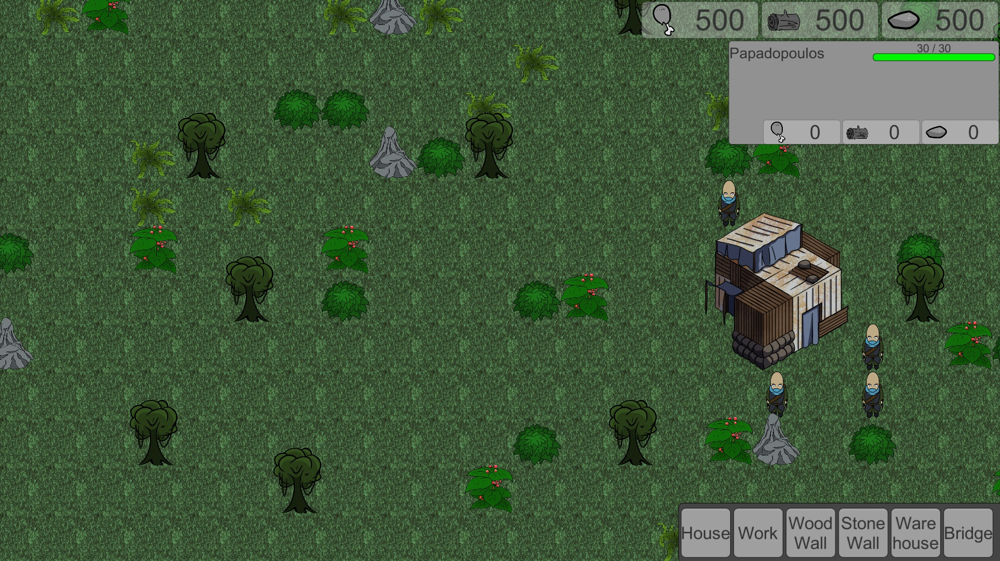
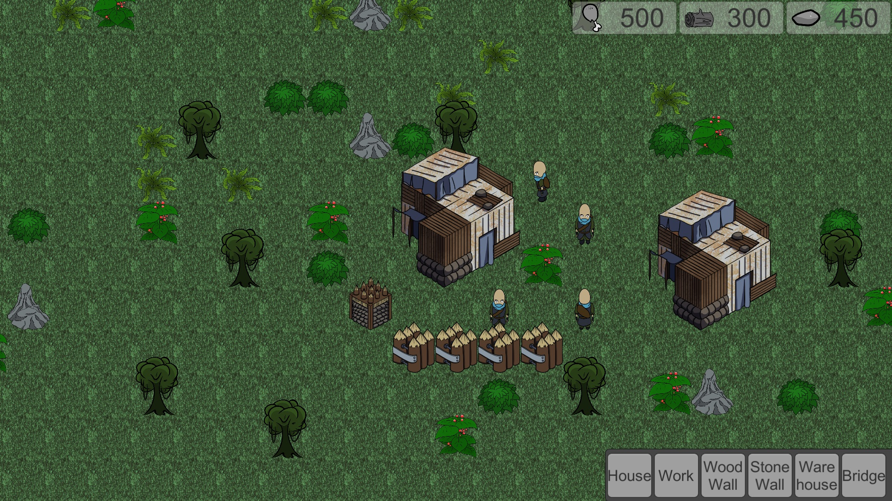

Hello everyone, thanks for checking out the game we've made.

We've had some issues when creating it, hence it's not as feature complete as we would have liked.

But still, here is the unfinished (yet) game we've made for the JAM ! Hope you can still enjoy it.

# Story

Robots are coming, they want to stop you as you’re one of the last remains of humanity. 
Guide this tribe, help them build a shelter and fight against the waves of drones! If you’re fast enough maybe you’d be able to reach the ancient ruin deep in the north containing the weapon that will save us all.
The path will be long, you may need to construct multiple bases. Good Luck!

# Controls
* Left click to select
* Right click to give order
* Building placement is bottom right
* Camera movement is WASD/ZQSD/Arrows

# Credits

## Dev

* fadoli03
* HerryFabien
* Astoeth
* Nanaki404

## Arts

* Corbak
* Nounka

## Sounds/Audio Effect (Third party)

from https://soundbible.com/ :
* Mike Koenig 
* Benboncan 
* Caroline Ford 
* Smoothie 
* Daniel Simion 
* wildcat

# Known Issues:

1. the workers can get stuck inside building
1. the UI elements doesn't stop interacting with the game and clicking between building menu can create some instances